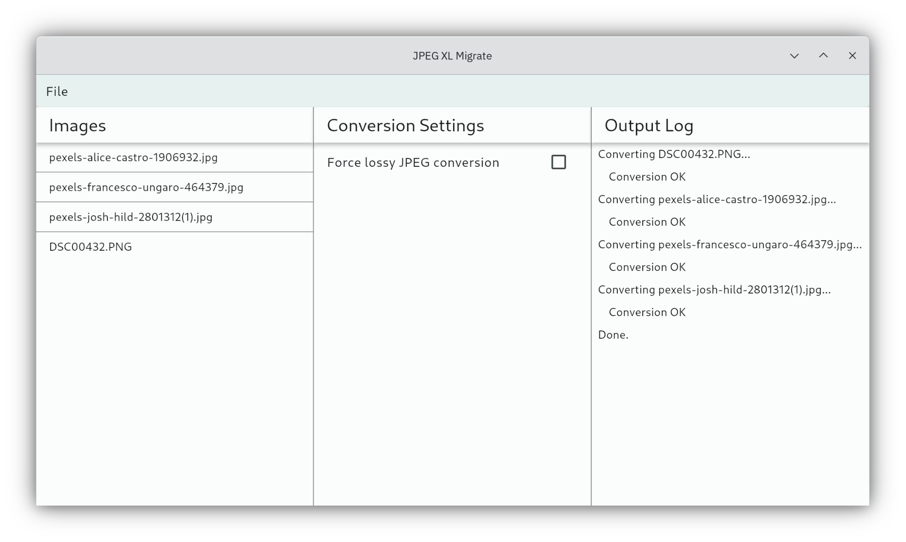

# jxl-migrate

`jxl-migrate` is a simple app to convert all applicable image files recursively in a folder to JPEG XL (JXL, `image/jxl`).

In case the conversion of an image is successful, the original image ise deleted and the JXL file will be all that's left.
The modified date is also copied to the converted file.

Since the app has been completely rebuilt from scratch, some features which used to be implemented got lost.
Lost features will be reimplemented over time.

## Features

`jxl-migrate` will try to do the following:

* Convert *JPEG and JPG* files into *lossless transcoded or lossy JXL*
* Convert *PNG* files into *lossless JXL*
* ~~Convert *lossless WebP* into *lossless or lossy JXL*~~ NOT YET SUPPORTED
* ~~Convert *lossy WebP* into *lossy JXL* (`-d 1`)~~ NOT YET SUPPORTED
* ~~Convert *GIF* files into *lossless or lossy animated JXL*~~ NOT YET SUPPORTED

The resulting JXL files will **not** be progressively encoded.

The original source will be deleted if the conversion succeeded.

`jxl-migrate` also supports rudimentary error handling. In case it fails to convert a file because `cjxl` or `dwebp` did not do its job properly, then the source file will not be deleted even if you tell it to.

~~`jxl-migrate` will also report the before-and-after total filesizes along with a percentage of how much file space you saved by converting to JXL.~~

## Requirements

**NOTE:** `webpinfo` and `dwebp` are not needed as of now since it can't handle WebP images for now.

`jxl-migrate` requires the following. All binaries should be added to the system's `PATH` environment variable so Python can run them.

* The `cjxl` binary (to actually convert images)
* The `webpinfo` binary (to check if a WebP is lossless or lossy so that it can convert the file accordingly)
* The `dwebp` binary (to decode WebP images into PNG images first because `cjxl` does not support WebP directly)

I intend to support Linux, Windows, and macOS (primarily Linux) but for now, builds will be available on Windows only until I figure out the others. I will add Linux builds but they might not run for you since I am building from Arch Linux and I did not include the needed dependencies, if there are.

## Usage

Just run the app. The specific steps depend on your operating system.

But basically,

* `File > Add files to convert` will scan a folder and add all images it can handle,
* Check that the settings are correct for your needs, and finally,
* `File > Start conversion` will do the conversion.

## Contributing

I welcome any pull requests that will improve the script. Please feel free to submit pull requests and I'll check them out. There is no coding guide, no rules to follow. As long as you tested your pull request and it works, just submit it! Thanks!

### Contributors!

Thank you very much to everyone who contributed code to this humble Python script. I really appreciate it, and I'm sure everyone trying to adopt JPEG XL appreciates it, too!

* [perk11](https://github.com/perk11) - Keep original file mtime in converted JXL, implement multithreading
    * Sorry, your contribution and the feature was lost because the app was completely rebuilt from scratch!

## Disclaimer

While I did use this script to migrate my entire image folder and did not notice any issues, I still cannot guarantee that the error handling in this script is perfect and I can't help it if files get lost or damaged or anything. I cannot take responsibility for that. I did my best to avoid that, since I actually intend to use this script myself, but you never know.

The detection of file format is done purely by file extension (not case sensitive), so in case a file ends with (for example) `.jpg` but is not actually an image, then the script will be confused and try to convert it. However, `cjxl` should fail and the script should detect that. In that case, the original (impostor) `.jpg` file will not be deleted. At least that's how I intended it to function.

The script runs assuming you have all requirements satisfied and does not check if there are missing requirements. If a requirement is missing, will try to tell you about it.

While I can't think of any bad reason (besides having a left-over PNG file converted from the original WebP with the original WebP file already deleted), closing the app one way or another while a conversion is running could be harmful and cause corrupted files. You have been warned.

# License

GNU General Public License 3 (GPL-3)

Please check `LICENSE` file for the complete license.
